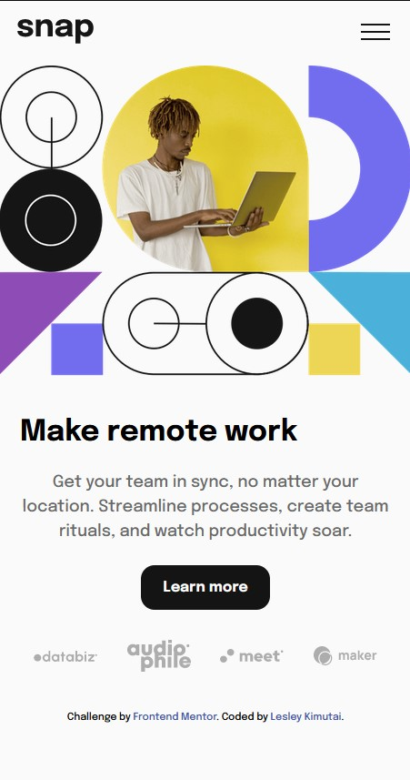
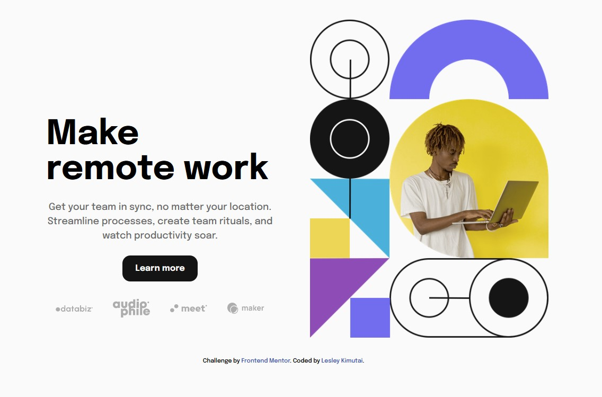

# Frontend Mentor - Intro section with dropdown navigation solution

This is a solution to the [Intro section with dropdown navigation challenge on Frontend Mentor](https://www.frontendmentor.io/challenges/intro-section-with-dropdown-navigation-ryaPetHE5). Frontend Mentor challenges help you improve your coding skills by building realistic projects.

## Table of contents

- [Overview](#overview)
  - [The challenge](#the-challenge)
  - [Screenshot](#screenshot)
  - [Links](#links)
- [My process](#my-process)
  - [Built with](#built-with)
  - [What I learned](#what-i-learned)
  - [Continued development](#continued-development)
  - [Useful resources](#useful-resources)
- [Author](#author)
- [Acknowledgments](#acknowledgments)

## Overview

### The challenge

Users should be able to:

- View the relevant dropdown menus on desktop and mobile when interacting with the navigation links
- View the optimal layout for the content depending on their device's screen size
- See hover states for all interactive elements on the page

### Screenshot

-Mobile View :-


-Tablet Mode:-


Laptop View:-


### Links

- Solution URL: [Github Link](https://github.com/issagoodlifeInc/intro-section.git)
- Live Site URL: [Intro--Sec Link](https://your-live-site-url.com)

## My process

### Built with

- Semantic HTML5 markup
- CSS custom properties
- Flexbox
- CSS Grid
- Mobile-first workflow
- [React](https://reactjs.org/) - JS library

### What I learned

```css
/* My media query for tablet and laptop screens */
@media only screen and (min-width: 620px) {
  main {
    display: flex;
    flex-direction: row-reverse;
    width: 95%;
    max-width: 1000px;
    margin: 2rem auto;
    align-items: center;
    gap: 1rem;
  }

  .main--content {
    width: 50%;
    max-width: 430px;
    align-self: end;
  }
  .main--img {
    width: 45%;
  }
}
```

- I expounded on nconditional rendering - code below used to show the hamburger icons

```jsx
{
  width < smallerScreens && !changeHamburger && (
    <button onClick={openMenu} className="hamburger-open">
      
    </button>
  );
}
{
  width < smallerScreens && changeHamburger && (
    <button onClick={closeMenu} className="hamburger-open">
      
    </button>
  );
}
```

### Continued development

- Better Tunaround time
- Better handling of responsive navigations
- Cleaner code

## Author

- Website - [Lesley Kimutai](https://leskim.github.io/myweb/)
- Frontend Mentor - [@leskim](https://www.frontendmentor.io/profile/leskim)
- Twitter - [@yourusername](https://www.twitter.com/yourusername)

## Acknowledgments
